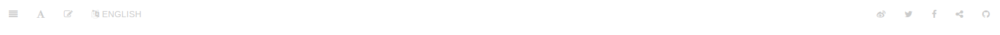

# plugin:my-toolbar

This plugin adds buttons with external links to a Gitbook website toolbar.



based on plugin [toolbar](https://github.com/Simran-B/gitbook-plugin-toolbar)

### Configuration

The buttons can be configured in **book.json**:

```js
{
    "plugins": [
        "my-toolbar"
    ],
    "pluginsConfig": {
        "my-toolbar": {
            "buttons":
            [
                {
                    "label": "GitHub",
                    "icon": "fa fa-github",
                    "url": "https://github.com/",
                    "target": "_self"
                },
                {
                    "label": "Search page title on StackOverflow",
                    "icon": "fa fa-stack-overflow",
                    "url": "http://stackoverflow.com/search?q={{title}}"
                },
                {
                    "label": "Share link on Facebook",
                    "icon": "fa fa-facebook",
                    "url": "http://www.facebook.com/sharer/sharer.php?s=100&p[url]={{url}}"
                },
                {
                    "label": "Share page title and link on Twitter",
                    "icon": "fa fa-twitter",
                    "position":"left",
                    "url": "http://twitter.com/home?status={{title}}%20{{url}}"
                },
                {
                    "label": "Edit page on github",
                    "text":"Edit",
                    "icon": "fa fa-pencil-square-o",
                    "position" : "left",
                    "url": "https://github.com/org/repo/edit/master/{{filepath_lang}}"
                }
                
            ]
        }
    }
}
```

### Button parameters

The table below lists the default values of the optional button parameters:

parameter | Default
---|---
label | Link
text | text show
icon | fa-external-link
position | right

### Format strings

The following format strings can be used in your urls:

String | Description
---|---
{{title}} | Title of page
{{url}} | URL of current page
{{filepath_lang}} | Filepath of the *source* page. This includes the language code in a multilingual book.


